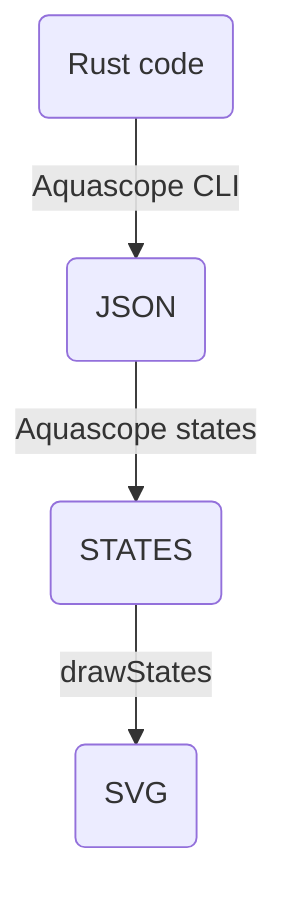

# Aquascope SVG

This tool takes in Aquascope JSON output and produces nice standalone
non-interative SVG diagrams suitable for publication online or in print.

## Workflow

The general flow:



The [Aquascope](https://github.com/cognitive-engineering-lab/aquascope) project
does the Rust code analysis. This can be a bit involved since it involves
compiling the snippet with a custom Rust compiler that allows some types of
errors and looking at the generated intermediate bytecode to extract program
state.

The Rust code analysis can be saved as JSON data using the `aquascope_cli` tool
in [this fork](https://github.com/nwhitehead/aquascope). You give it a short
Rust program filename and it outputs the JSON data to `stdout`.

Next, this project has a tool for converting the JSON format to a new custom
diagram representation format `STATES`. This is a human-readable text
format that uses some Markdown conventions and 

This project then takes the JSON output and can create an SVG file. Usually this
will be called from some sort of document preparation system (e.g. during
Markdown rendering).

### JSON format

Get the JSON output using the `aquascope_cli` binary in [this
fork](https://github.com/nwhitehead/aquascope). You give it a short Rust program
filename and it outputs the JSON data to `stdout`.

### Code blocks

An example would be a workflow where you write content in Markdown including
code fences with Rust code examles. Some code block might be annotated with
`aquascope` and options to indicate post-processing beyond just syntax
highlighting. The Markdown renderer would extract the code block, pass it to
`aquascope_cli`, pass the JSON result to this project, then render the diagram
as typeset code followed by the SVG diagram.

### SVG theming

The output can be themed to match other surrounding content. Various options to
this program choose sizes, colors, and spacing.

## Options

## Building from source

```bash
cargo build --release
```

You can run some simple tests with:

```bash
cargo test
```
