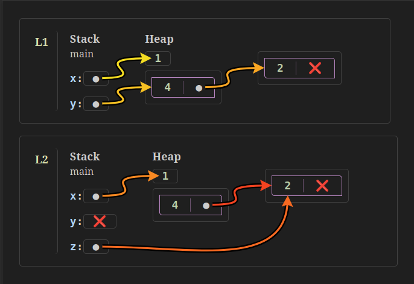
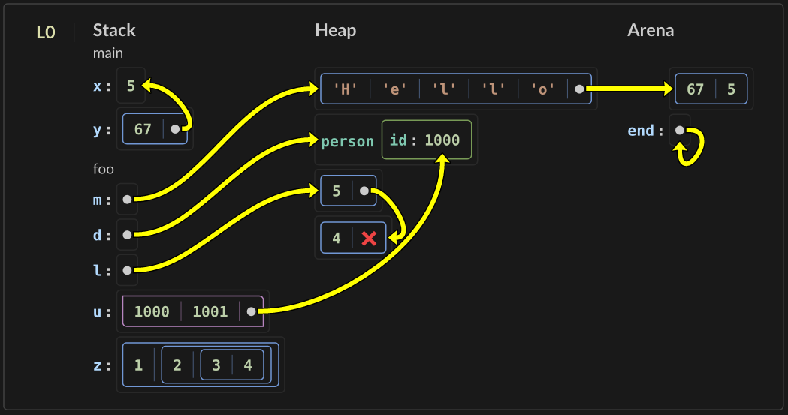

# Kaya - memory state diagram tool

Kaya is a set of tools for producing beautiful memory state diagrams for small
example programs.

Kaya introduces a human readable diagram text format that can be used to create
diagrams for any language. The diagrams created can be in PNG format and aim to
be high quality for publication online or in print. Kaya can also connect to the
Aquascope project to automatically analyze Rust code and produce diagrams.

Try it out online here: [kaya.shimmermathlabs.com](kaya.shimmermathlabs.com)

## Kaya Format

Kaya is a human-readable text format that uses some Markdown conventions and
encodes program state at various points.

Here is an example `kaya` diagram description:
```
# L1
## Stack
### main
x: ptr(H0)
y: ptr(H1)
## Heap
H0: 1
H1: (4, ptr(H2))
##
H2: (2, *)

# L2
## Stack
### main
x: ptr(H0)
y: *
z: ptr(H2.0).ds
## Heap
H0: 1
H1: (4, ptr(H2))
##
H2: (2, *)
```

This will render to:



Here is another example showing more features of Kaya:



## Manual

See the [Manual](https://kaya.shimmermathlabs.com/manual) for examples of
Kaya diagrams and how you might use them.

See [FORMAT.md](docs/FORMAT.md) for details on the `kaya` diagram description format.

## Workflows

### Online Workflow

The simplest workflow for `kaya` is to use the [online
editor](https://kaya.shimmermathlabs.com/) to generate your diagram and save it
as a PNG file once done. The online editor has options to choose a resolution,
transparent background, and light or dark theme.

### Command-line Workflow

Another workflow is that you write a `kaya` diagram description directly in a
text editor then use the `render_kaya` command-line tool to create the output
PNG file. The diagram can then be included inside other works.

The `render_kaya` tool has the following options:

```
A tool for rendering Kaya diagrams

Usage: render_kaya [OPTIONS] [INPUT]...

Arguments:
  [INPUT]...  Input filename(s)

Options:
      --show-parse       Parse the input and show debug parsing output to stdout
      --scale <SCALE>    Set scale factor for PNG output, 1.0 is web standard 96 DPI, 3.125 is 300 DPI
      --theme <THEME>    Choose theme, choices are: dark, light, dark_transparent, light_transparent
      --output <OUTPUT>  Output filename(s), required, (use - for stdout), (must be PNG)
  -h, --help             Print help
```

### Kaya in Markdown Workflow

It is also possible to put `kaya` format diagrams inside Markdown
documents.

In this case the locations where `kaya` diagrams appear in the source text can
be code fences in the Markdown source tagged with `kaya`. This workflow requires
a Markdown processor plugin that extracts the `kaya` blocks, calls `render_kaya`
to get PNG output, then includes the output in the final rendered Markdown.

This repository includes a [demonstration
program](kaya_web/src/components/Manual.vue) written in Vue that shows the Kaya
manual Markdown on a webpage using the [remark
ecosystem](https://remark.js.org/). You can see the final result online at the
[Kaya manual](https://kaya.shimmermathlabs.com/manual).

### Automatic Rust Analysis Workflow

It is also possible to use Kaya as part of a fully automated
analysis pipefile for Rust code.

```
Rust code --> JSON analysis --> Kaya format --> PNG diagram
```

#### Details

The [Aquascope](https://github.com/cognitive-engineering-lab/aquascope) project
does the Rust code analysis (Rust to JSON). This can be a bit involved since it
involves compiling the snippet with a custom Rust compiler that allows some
types of errors and looking at the generated intermediate bytecode to extract
program state.

The Rust code analysis is saved as JSON data using the `aquascope_cli` tool in
[this fork](https://github.com/nwhitehead/aquascope). You give it a file
containing a short Rust program and it outputs the JSON analysis data to
`stdout`.

Next, this project has a tool `aquascope_json_to_kaya` for converting the JSON
format to `kaya` format. 

This project has a tool `render_kaya` for rendering `kaya` diagrams into PNG.
Usually this will be called from some sort of document preparation system (e.g.
during Markdown rendering).

## Building from source

In general `kaya` is a Rust project that uses standard Rust tools through
`cargo`.

To build:

```bash
cargo build --release
```

You can run some simple tests with:

```bash
cargo test
```

The project includes a toplevel `Justfile` for convenience.

To build appropriate parts of the project for the web, use:
```bash
just wasm
```

The final distributable files for the JS `kaya` package are in `kaya_ts/dist/`.
